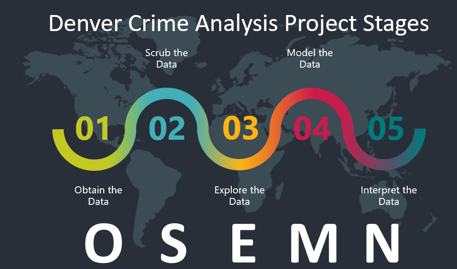
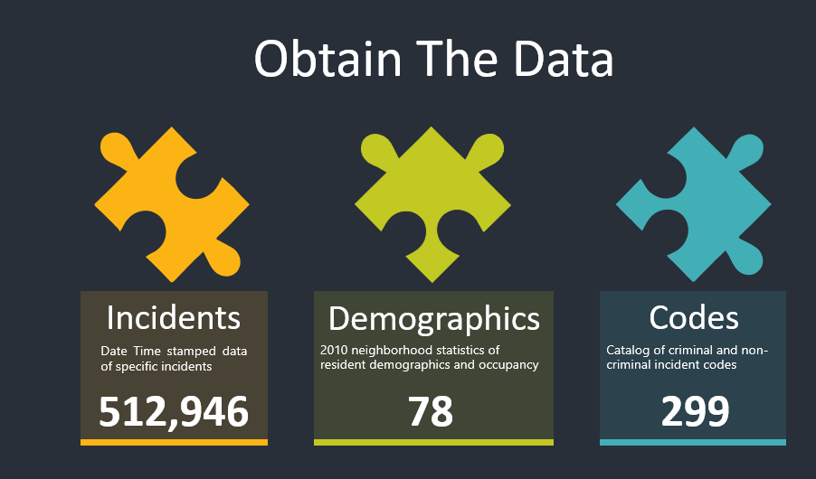
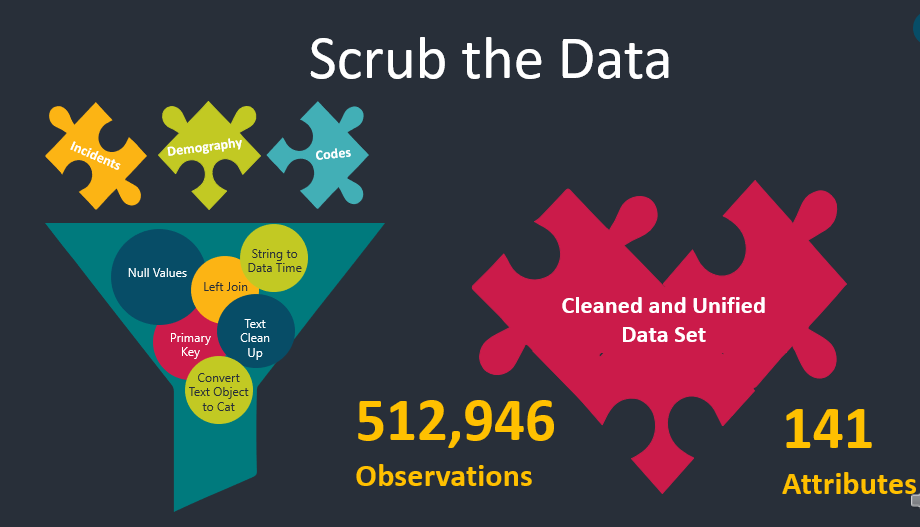

# MSDS-692-Data-Science-Practicum-I

The Denver Crime Analysis Project aims to create a predictive model of crime using two data sets available from the City of Denver Open Data Catalog, the first being the reported crime statistics and the second being the 2010 Census Data. Both data sets use neighborhood information which will act as the primary key linking the two data sets enabling a good analysis and modeling.

# Project Phases Overview

This proejct followed teh OSEMN Framework nicely summarized by Dr. Cher Han Lau (located @ https://towardsdatascience.com/5-steps-of-a-data-science-project-lifecycle-26c50372b492) which includes the following 5 basic steps.

It is worth noting that any project of this nature (and far more complex) will often be iterative.  It may be that upon completion of the data cleansing the data scientist determines more data is required to properly complete the objectives of the project.  Likewise, during the EDA phase, one may determine the cleaning process needs to be performed over again because bad data is skewing the results and so on.  Due to time constraints, an appropriate level of iteration was not undertaken and basis for improvement on the foundation this project provides.

## Obtain the Data

As noted above, there are three data sets being used in this analysis the crime data from the City of Denver Open Data Catalog, the City of Denver 2010 Census Data, and the City of Denver Offense Codes.

From the City of Denver Open Data Catalog (located @ https://www.denvergov.org/opendata/dataset/city-and-county-of-denver-crime)," this dataset includes criminal offenses in the City and County of Denver for the previous five calendar years plus the current year to date. The data is based on the National Incident Based Reporting System (NIBRS) which includes all victims of person crimes and all crimes within an incident. These data are dynamic, which allows for additions, deletions and/or modifications at any time, resulting in more accurate information in the database. Due to continuous data entry, the number of records in subsequent extractions are subject to change. Crime data is updated Monday through Friday."

Also from the City of Denver Open Data Catalog (located @ https://www.denvergov.org/opendata/dataset/city-and-county-of-denver-census-neighborhood-demographics-2010), "this is a dataset which includes layers from Community Planning and Development with additional demographic information compiled from the 2010 US Census. The City of Denver reports that every effort was made to ensure that blocks were assigned to their proper neighborhoods, due to geographic problems inherent in the original 2010 census block data, errors may exist. This data set includes the housing and population data from redistricting file P.L. 94-171 of the 2010 census. The data-set does not contain data for any enclaves administered by other jurisdictions that are located within the City and County of Denver's boundary."

The Crime Dataset contains 512946 observations of the following 19 attributes: 

1. INCIDENT_ID               512946 non-null float64
1. OFFENSE_ID                512946 non-null float64
1. OFFENSE_CODE              512946 non-null int64
1. OFFENSE_CODE_EXTENSION    512946 non-null int64
1. OFFENSE_TYPE_ID           512946 non-null object
1. OFFENSE_CATEGORY_ID       512946 non-null object
1. FIRST_OCCURRENCE_DATE     512946 non-null object
1. LAST_OCCURRENCE_DATE      162450 non-null object
1. REPORTED_DATE             512946 non-null object
1. INCIDENT_ADDRESS          462825 non-null object
1. GEO_X                     508707 non-null float64
1. GEO_Y                     508707 non-null float64
1. GEO_LON                   508707 non-null float64
1. GEO_LAT                   508707 non-null float64
1. DISTRICT_ID               512946 non-null int64
1. PRECINCT_ID               512946 non-null int64
1. NEIGHBORHOOD_ID           512946 non-null object
1. IS_CRIME                  512946 non-null int64
1. IS_TRAFFIC                512946 non-null int64

The Census Dataset contains 78 observations of 127 different attributes.  For the sake of brevity, the 127 attributes are listed here but generally include information that identifies neighborhoods, resident gender, resident ethnicity, housing, resident age categories, and other demographic data.

The final dataset is the Crime Codes Dataset which contains 299 observations of the following 8 attributes:

1. OFFENSE_CODE              299 non-null int64
1. OFFENSE_CODE_EXTENSION    299 non-null int64
1. OFFENSE_TYPE_ID           299 non-null object
1. OFFENSE_TYPE_NAME         299 non-null object
1. OFFENSE_CATEGORY_ID       299 non-null object
1. OFFENSE_CATEGORY_NAME     299 non-null object
1. IS_CRIME                  299 non-null int64
1. IS_TRAFFIC                299 non-null int64

## Scrub the Data

The first step in scrubbing the data was to identify and address missing values.  The missing values within the crime data set are constrained to the LAST_OCCURENCE_DATE, INCIDENT_ADDRESS, GEO_X, GEO_Y, GEO_LON, and GEO_LAT.  The analysis focuses on using the FIRST_OCCURENCE_DATE for time values and thus is not required for the analysis.  INCIDENT_ADDRESS is not always known or reported; however, it is redundant in this analysis because NEIGHBORHOOD_ID is used for location information.  Similarly, and the GEO_* information is not required and so these attributes are all dropped from the merged data set.

Additionally, several of the attribute had "-" embeded in the text of each which was replaced with a space as well as the first letter was capitalized.  Finally, the NEIGHBORHOOD_ID attribute (which is common accross the crimes data set and the census data set) required changing to match exactly as the neighborhood naming convention was slightly different from the two data sets.

## Exploratory Data Analysis

## Obtain the Data

## Obtain the Data

## References
Lau, C. H. (2019, January 10). 5 Steps of a Data Science Project Lifecycle. Retrieved from https://towardsdatascience.com/5-steps-of-a-data-science-project-lifecycle-26c50372b492

