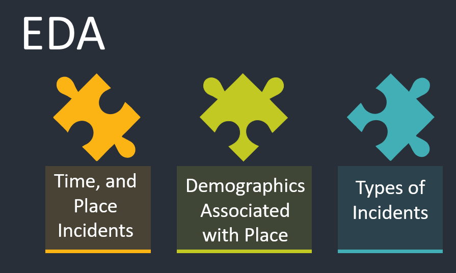
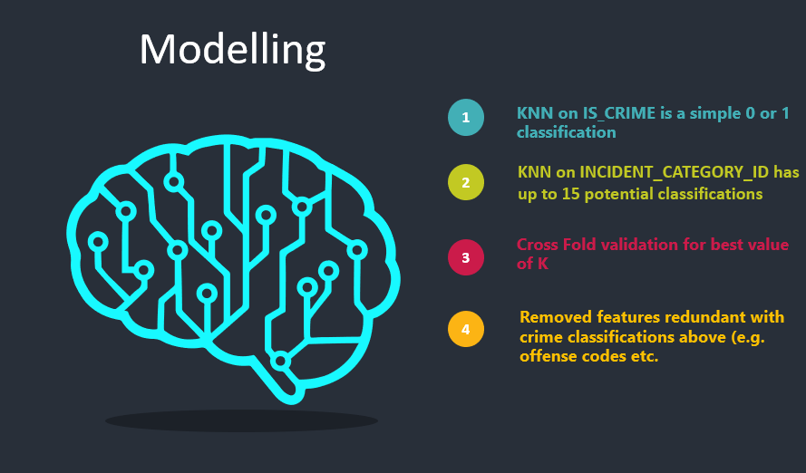
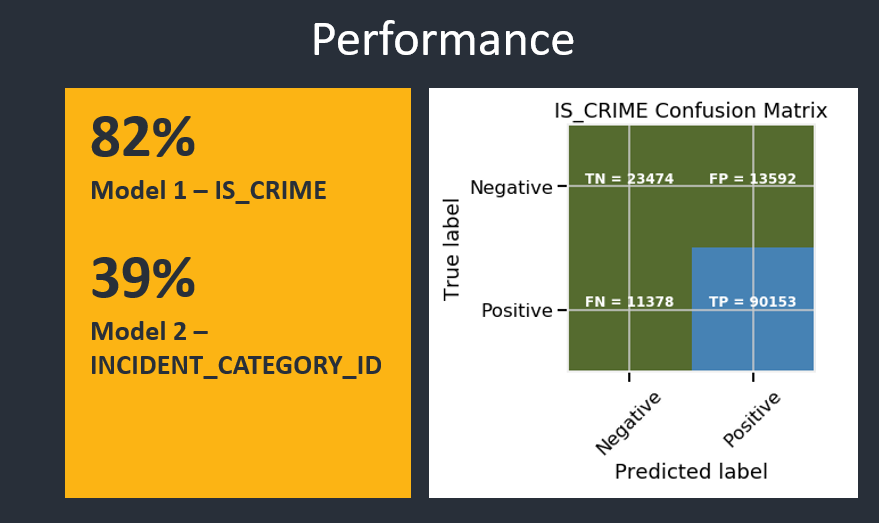

# MSDS-692-Data-Science-Practicum-I

The Denver Crime Analysis Project aims to create a predictive model of crime using two data sets available from the City of Denver Open Data Catalog, the first being the reported crime statistics and the second being the 2010 Census Data. Both data sets use neighborhood information which will act as the primary key linking the two data sets enabling a good analysis and modeling.

# Project Phases Overview

This proejct followed teh OSEMN Framework nicely summarized by Dr. Cher Han Lau (located @ https://towardsdatascience.com/5-steps-of-a-data-science-project-lifecycle-26c50372b492) which includes the following 5 basic steps.

It is worth noting that any project of this nature (and far more complex) will often be iterative.  It may be that upon completion of the data cleansing the data scientist determines more data is required to properly complete the objectives of the project.  Likewise, during the EDA phase, one may determine the cleaning process needs to be performed over again because bad data is skewing the results and so on.  Due to time constraints, an appropriate level of iteration was not undertaken and basis for improvement on the foundation this project provides.

## Obtain the Data

As noted above, there are three data sets being used in this analysis the crime data from the City of Denver Open Data Catalog, the City of Denver 2010 Census Data, and the City of Denver Offense Codes.

From the City of Denver Open Data Catalog (located @ https://www.denvergov.org/opendata/dataset/city-and-county-of-denver-crime)," this dataset includes criminal offenses in the City and County of Denver for the previous five calendar years plus the current year to date. The data is based on the National Incident Based Reporting System (NIBRS) which includes all victims of person crimes and all crimes within an incident. These data are dynamic, which allows for additions, deletions and/or modifications at any time, resulting in more accurate information in the database. Due to continuous data entry, the number of records in subsequent extractions are subject to change. Crime data is updated Monday through Friday."

Also from the City of Denver Open Data Catalog (located @ https://www.denvergov.org/opendata/dataset/city-and-county-of-denver-census-neighborhood-demographics-2010), "this is a dataset which includes layers from Community Planning and Development with additional demographic information compiled from the 2010 US Census. The City of Denver reports that every effort was made to ensure that blocks were assigned to their proper neighborhoods, due to geographic problems inherent in the original 2010 census block data, errors may exist. This data set includes the housing and population data from redistricting file P.L. 94-171 of the 2010 census. The data-set does not contain data for any enclaves administered by other jurisdictions that are located within the City and County of Denver's boundary."

The Crime Dataset contains 512946 observations with 19 attributes associated with characterizes the type incident, whether it is criminal or traffic, and the location information associated with the incident. The Census Dataset contains 78 observations of 127 different attributes.  For the sake of brevity, the 127 attributes are listed here but generally include information that identifies neighborhoods, resident gender, resident ethnicity, housing, resident age categories, and other demographic data.  The final dataset is the Crime Codes Dataset which contains 299 observations of the following 8 attributes:

## Scrub the Data

The first step in scrubbing the data was to identify and address missing values.  The missing values within the crime data set are constrained to the LAST_OCCURENCE_DATE, INCIDENT_ADDRESS, GEO_X, GEO_Y, GEO_LON, and GEO_LAT.  The analysis focuses on using the FIRST_OCCURENCE_DATE for time values and thus is not required for the analysis.  INCIDENT_ADDRESS is not always known or reported; however, it is redundant in this analysis because NEIGHBORHOOD_ID is used for location information.  Similarly, and the GEO_* information is not required and so these attributes are all dropped from the merged data set.

Additionally, several of the attribute had "-" embeded in the text of each which was replaced with a space as well as the first letter was capitalized.  Finally, the NEIGHBORHOOD_ID attribute (which is common accross the crimes data set and the census data set) required changing to match exactly as the neighborhood naming convention was slightly different from the two data sets.  Finally, the LAST_OCCURENCE_DATE attribute was converted from an object to a datetime prior to a left join (crimes data <- census data).

## Exploratory Data Analysis

The EDA had three elements to it.  First, it took a look at the types of incidents and there frequency by count of INCIDENT_ID.  An example of the data is represented below in word cloud.  The analysis also examined time effects on crime as the bar chart which shows the hourly distribution of incidents across the data set.  Lastly, the analysis examined the demographic makeup of each neighborhood which corresponds to the neighborhood information within the crime data set.

## Modeling and Results

Build a KNN Model with Target and Attribute data based on the merged data set.  The first Model will look at the IS_CRIME variable and attempt to predic when an incident is categorized as a crime versus those incidents where it is purely a traffic incident. This KNN model will be denoted as Model1.

In Model1 I am removing all the attributes which are redundant to the IS_CRIME category (e.g. OFFENSE_ID) because these are clear criminal and non-criminal codes.  A machine learning algorithm which used these attributes would be trivial in nature.

Selecting the correct value of K for the K Nearest Neighbor algorihm is important for any given solution to work as best as possible.  If K is too small, noise will unduly influence the result and thus one risks overfitting the problem.  A value of K that is too large becomes computationally expensive and undermines the theory points near are of similar groups.

To find the optimal value of K, I used Cross Validation. Define a range of K values to test and determine the best number of neighbors.  The code below loops through this range and calculates the accuracy.  While accuracy may not be the overall best measure of the quality of a solution, it is useful as relative measure between similar models for the purposes of identifying a K value.

As before, build a KNN Model with Target and Attribute data based on the merged data set.  This second Model will look at the OFFENSE_CATEGORY_ID variable and attempt to accurately classify the type of incident that has occurred (e.g. larceny) rather than just is it a traffic incident or a criminal incident. This KNN model will be denoted as Model2.  In Model2 I am removing all the attributes which are redundant to the OFFENSE_CATEGORY_ID category (e.g. OFFENSE_ID) because these are clear criminal and non-criminal codes.

As seen above, Model1 had an 82% accuracy while Model2 had a 39% accuracy.  More detailed analysis of the results and discussion of the modeling performance and results are covered in the presentation found here @ 

## References
Lau, C. H. (2019, January 10). 5 Steps of a Data Science Project Lifecycle. Retrieved from https://towardsdatascience.com/5-steps-of-a-data-science-project-lifecycle-26c50372b492

Denver Open Data Catalog: Crime. (n.d.). Retrieved from https://www.denvergov.org/opendata/dataset/city-and-county-of-denver-crime

Dr. Cher Han Lau. (2019, January 10). 5 Steps of a Data Science Project Lifecycle. Retrieved from https://towardsdatascience.com/5-steps-of-a-data-science-project-lifecycle-26c50372b492

Generating WordClouds in Python. (n.d.). Retrieved from https://www.datacamp.com/community/tutorials/wordcloud-python

Petrou, T. (2019, October 1). Selecting Subsets of Data in Pandas: Part 1. Retrieved from https://medium.com/dunder-data/selecting-subsets-of-data-in-pandas-6fcd0170be9c

Python | Pandas DataFrame. (n.d.). Retrieved from https://www.geeksforgeeks.org/python-pandas-dataframe/

Sharma, M. (2018, November 3). Data Visualization using Seaborn. Retrieved from https://towardsdatascience.com/data-visualization-using-seaborn-fc24db95a850

Style sheets reference — Matplotlib 3.1.1 documentation. (n.d.). Retrieved from https://matplotlib.org/3.1.1/gallery/style_sheets/style_sheets_reference.html

Summarising, Aggregating, and Grouping data in Python Pandas. (2019, October 6). Retrieved from https://www.shanelynn.ie/summarising-aggregation-and-grouping-data-in-python-pandas/

